# Raumania Fragrance

Elevate Your Senses with Timeless Scents

At **Raumania Fragrance**, we craft luxurious scents that capture emotions, memories, and moments. Each fragrance is designed to elevate your senses, blending the finest ingredients to create timeless aromas. Our mission is to inspire confidence, celebrate identity, and leave behind something unforgettable—while championing sustainability and ethical sourcing.

## 🛠️ Tech Stack Overview

**Backend:**
- [Spring Boot 3](https://spring.io/projects/spring-boot) (Java 17)
- [MySQL](https://www.mysql.com/) for relational data
- [Redis](https://redis.io/) for caching & sessions
- [Elasticsearch](https://www.elastic.co/elasticsearch/) for product search
- [Stripe](https://stripe.com/) for payments
- [Cloudinary](https://cloudinary.com/) for image hosting
- [JWT](https://jwt.io/) authentication

**Frontend:**
- [Next.js 15](https://nextjs.org/) (React 19, App Router)
- [Tailwind CSS](https://tailwindcss.com/) for styling
- [Three.js](https://threejs.org/) & [@react-three/fiber](https://docs.pmnd.rs/react-three-fiber/getting-started/introduction) for 3D perfume builder
- [Zustand](https://zustand-demo.pmnd.rs/) for state management
- [Radix UI](https://www.radix-ui.com/) components
- [Recharts](https://recharts.org/) for analytics

**Chatbot:**
- [Flask](https://flask.palletsprojects.com/) (Python 3.13)
- [LangChain](https://www.langchain.com/), [Ollama](https://ollama.com/), [HuggingFace](https://huggingface.co/) for LLM Q&A
- [FAISS](https://faiss.ai/) for vector search

**Infrastructure:**
- [Docker Compose](https://docs.docker.com/compose/) for orchestration
- [Nginx](https://nginx.org/) as reverse proxy

## ✨ Main Features

### User Experience
- **Browse & Search:** Discover luxury perfumes, filter by brand, scent, and more
- **3D Perfume Builder:** Design your own fragrance bottle in real-time 3D
- **Product Details:** Rich product pages with images, descriptions, and reviews
- **Cart & Checkout:** Seamless shopping cart, multiple payment methods (Stripe, PayPal, etc.)
- **Order Tracking:** View order history and status
- **Profile Management:** Update personal info, addresses, and passwords
- **Product Reviews:** Share and read reviews
- **Contact & Support:** Reach out via contact form
- **Authentication:** Register, login, password reset, secure JWT auth

### Admin Dashboard
- **Analytics:** Dashboard with sales, users, and product stats
- **Product Management:** Add/edit/delete products, variants, images
- **Brand Management:** Manage fragrance brands
- **Order Management:** View and update orders
- **User Management:** Manage users and roles
- **Review Moderation:** Approve or remove reviews

### AI Chatbot
- **Product Q&A:** Ask about products, prices, variants, and brands
- **Natural Language:** Powered by local LLM (Ollama + LangChain)
- **Contextual Answers:** Uses up-to-date product/brand data
- **Integrated UI:** Chat bubble on every page

## 🚀 Getting Started

### Prerequisites
- [Docker & Docker Compose](https://docs.docker.com/get-docker/)

### Quick Start
```bash
git clone https://github.com/lily-iker/raumania.git
cd raumania
cp client/.env.example client/.env
cp server/.env.example server/.env
# (Edit .env files as needed)
docker-compose up -d
```
- Visit [http://localhost](http://localhost) for the app

## 🎬 Demo

### Home Page


### Product Page


### Custom Perfume Builder


### Checkout Flow


### Chatbot


---

### User Screens

<table>
  <tr>
    <td align="center">
      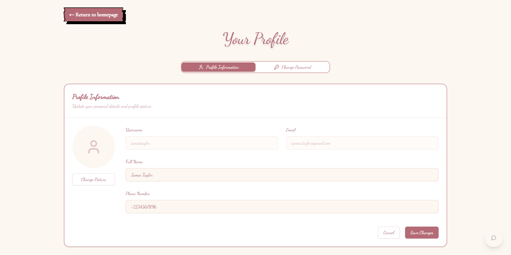
      <br><strong>User Profile</strong>
    </td>
    <td align="center">
      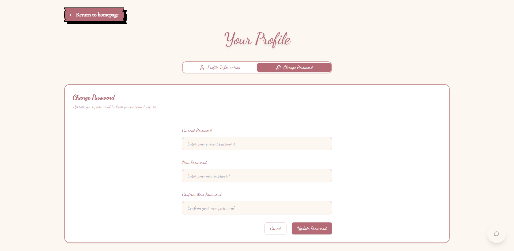
      <br><strong>User Profile 2</strong>
    </td>
    <td align="center">
      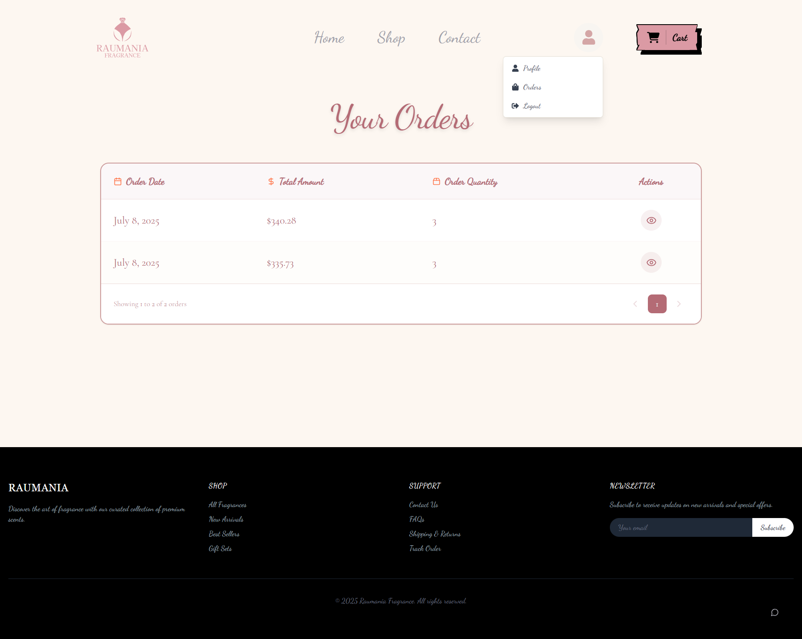
      <br><strong>User Orders</strong>
    </td>
  </tr>
  <tr>
    <td align="center">
      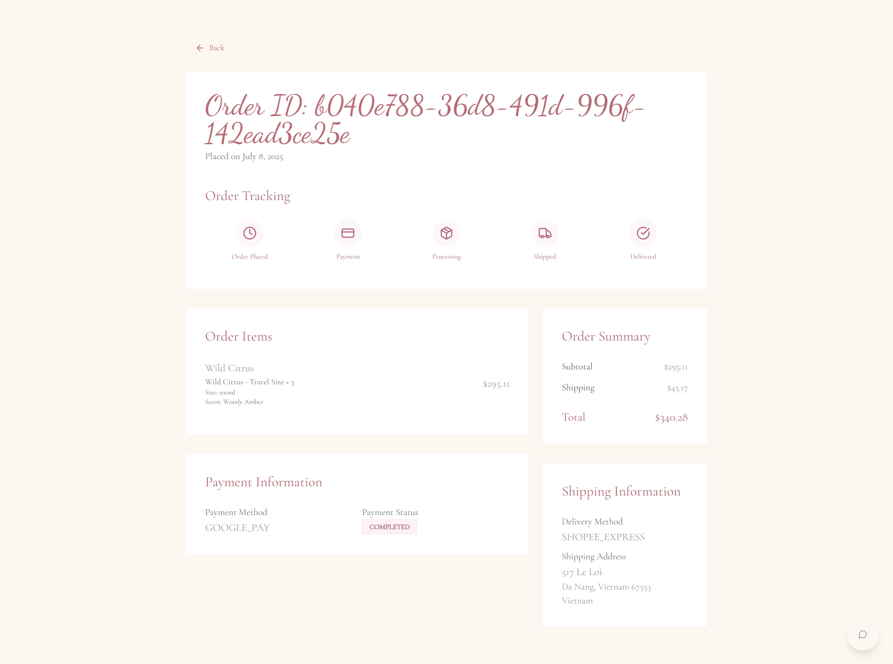
      <br><strong>User Order Detail</strong>
    </td>
    <td align="center">
      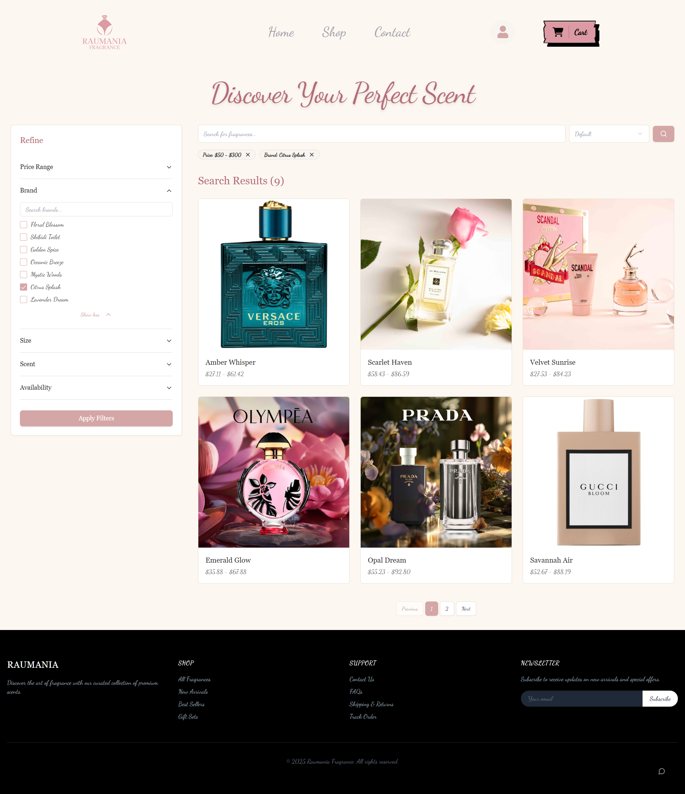
      <br><strong>Search Page</strong>
    </td>
    <td align="center">
      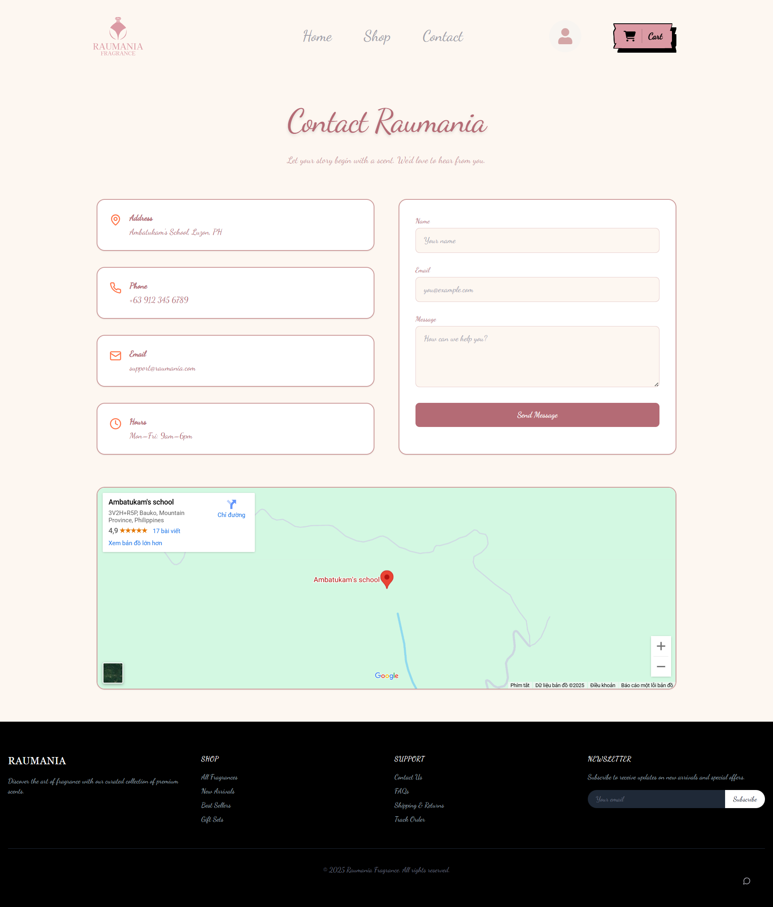
      <br><strong>Contact Page</strong>
    </td>
  </tr>
</table>

### Admin Screens

<table>
  <tr>
    <td align="center">
      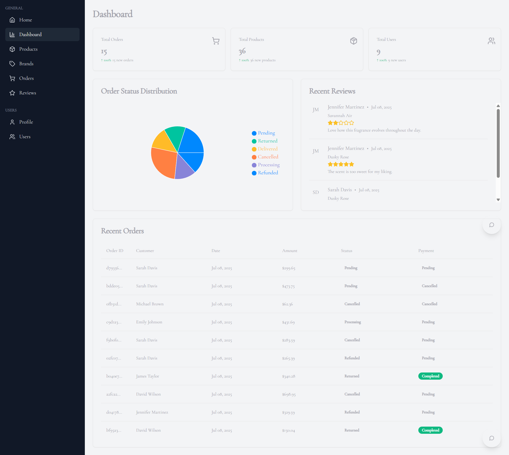
      <br><strong>Admin Dashboard</strong>
    </td>
    <td align="center">
      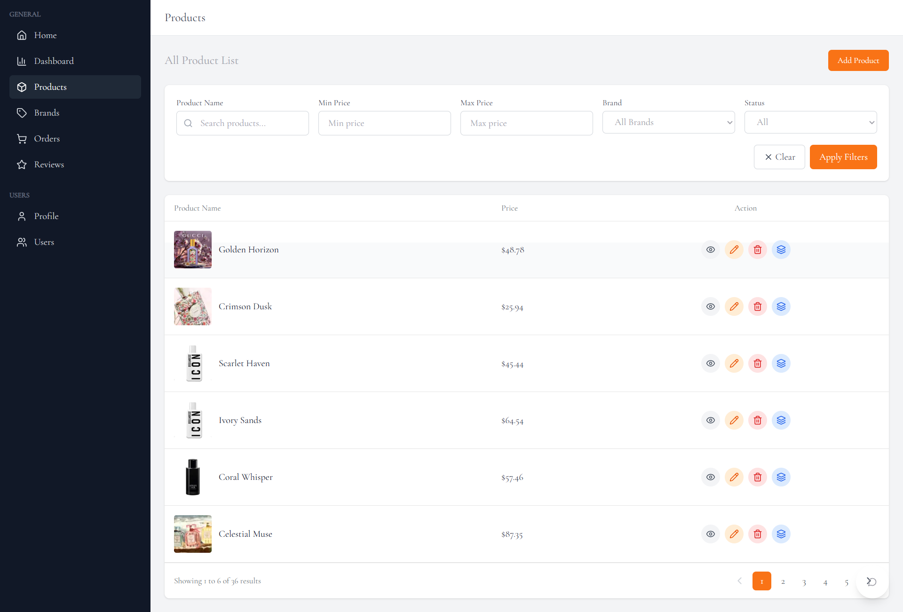
      <br><strong>Admin Products</strong>
    </td>
    <td align="center">
      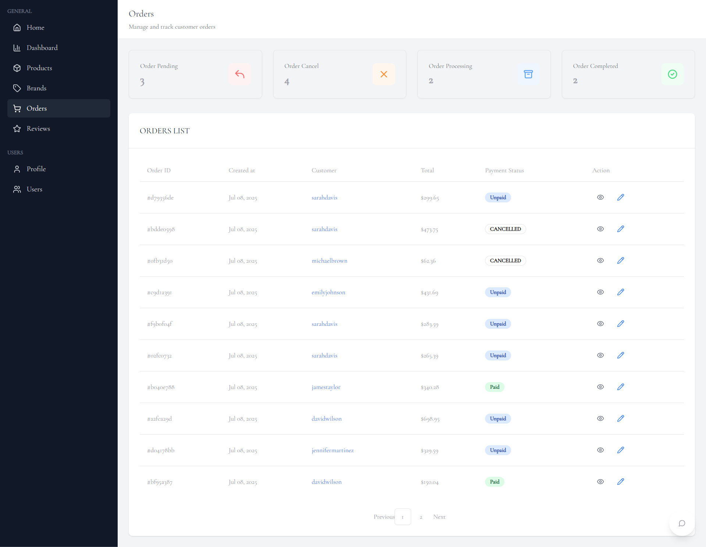
      <br><strong>Admin Orders</strong>
    </td>
  </tr>
  <tr>
    <td align="center">
      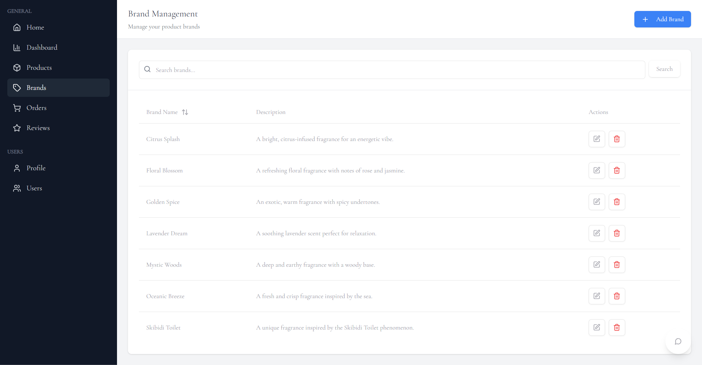
      <br><strong>Admin Brands</strong>
    </td>
    <td align="center">
      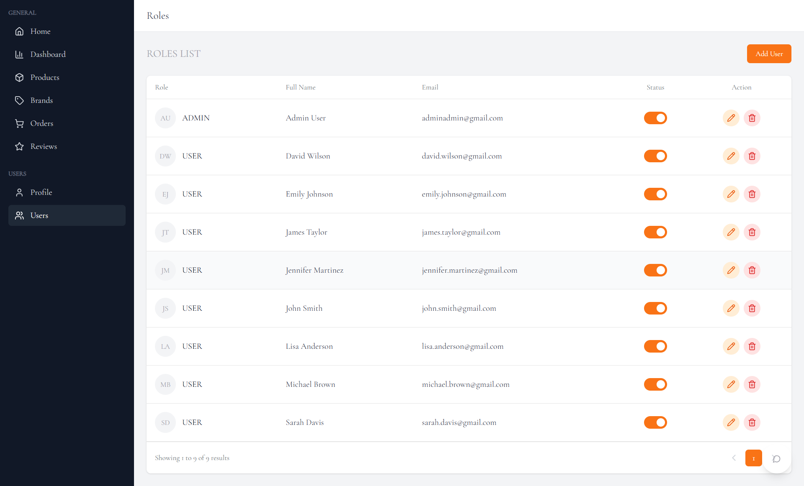
      <br><strong>Admin Users</strong>
    </td>
    <td align="center">
      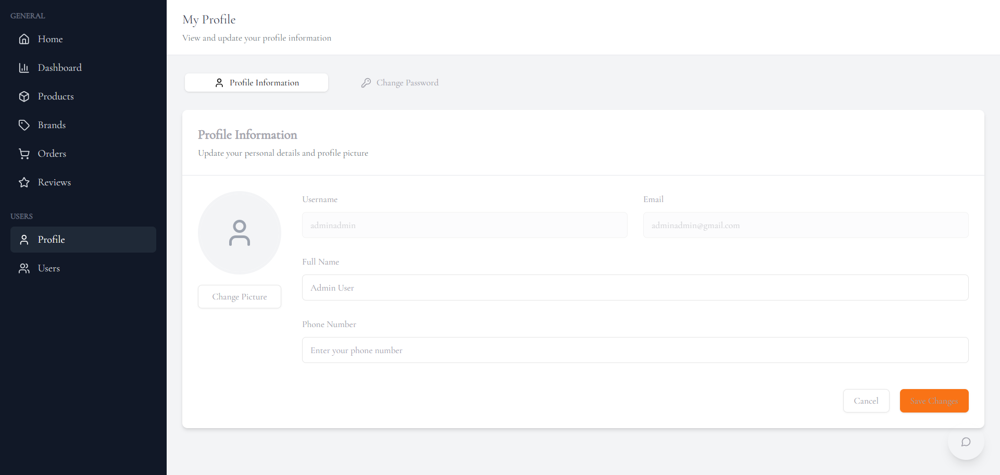
      <br><strong>Admin Profile</strong>
    </td>
  </tr>
  <tr>
    <td align="center">
      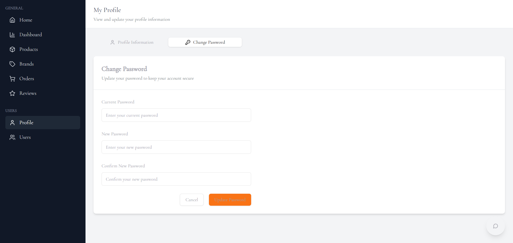
      <br><strong>Admin Profile 2</strong>
    </td>
    <td align="center">
      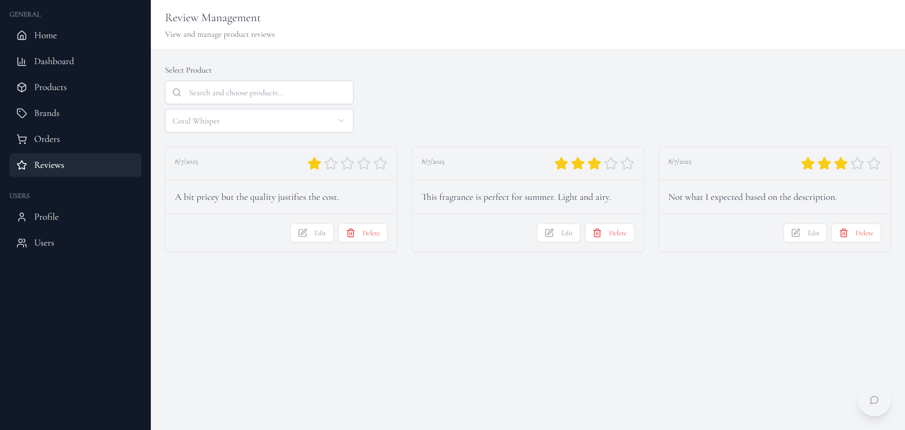
      <br><strong>Admin Reviews</strong>
    </td>
    <td></td>
  </tr>
</table>

## 🙏 Credits

**Contributors:** [aoi36](https://github.com/aoi36) and [dungx2](https://github.com/dungx2)